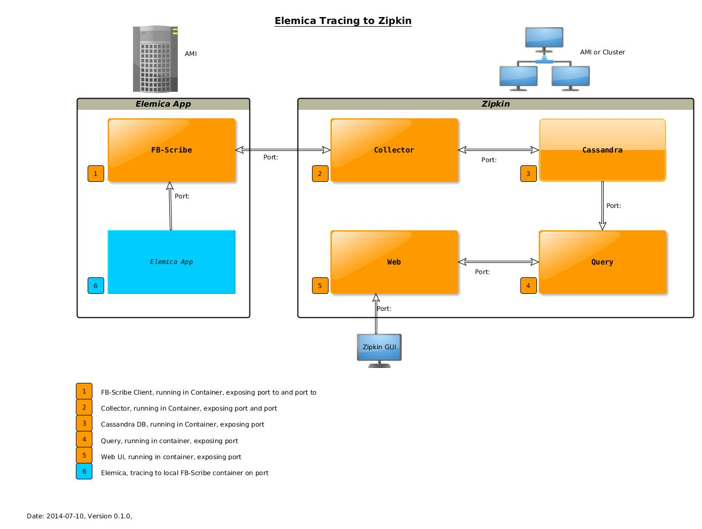

zipkin-infrastructure
=====================

All components needed to run Zipkin in Docker containers (Cassandra, Collector, Query, Web, and FB-Scribe)
We build a Zipkin base container installing scala and zipkin.
From this docker image, we derive the specifig zipkin parts to combine a zipkin infrastructure.
Directorey fb-scribe will generate a facebook [scribe](https://github.com/facebookarchive/scribe) service 
ready to communicat with zipkin collector. The same functionallity can be obtained by using a [Scala Akka Tracing](https://github.com/levkhomich/akka-tracing) mechanism.

 

### Directory structure

 * Directory [base](https://github.com/elemica/zipkin-infrastructure/tree/master/base) generates a docker container with scala and zipkin installed
 * Directory [cassandra](https://github.com/elemica/zipkin-infrastructure/tree/master/cassandra) generates a docker container with cassandra installed
 * Directory [collector](https://github.com/elemica/zipkin-infrastructure/tree/master/collector) generates a docker container zipkin collector installed
 * Directory [query](https://github.com/elemica/zipkin-infrastructure/tree/master/query) generates a docker container with zipkin query installed
 * Directory [web](https://github.com/elemica/zipkin-infrastructure/tree/master/web) generates a docker container with zipkin web
 * Directory [script](https://github.com/elemica/zipkin-infrastructure/tree/master/script) contains utilites to manage (build, push, pull, start, deploy ) the zipkin container.

### Zipkin Port Structure
As we store the tracing data in a cassandra DB, we first of all start this container naming it `zipkin-cassandra` as defined by `NAME_PRFIX` in [config.sh](https://github.com/elemica/zipkin-infrastructure/blob/master/script/config.sh) and link  `zipkin-collector`, `zipkin-query` and `zipkin-web` to it.
All ports we use are defined in  [config.sh](https://github.com/elemica/zipkin-infrastructure/blob/master/script/config.sh).

| Variable| Port| Exposed by | Description |
|:---------|:---------|:-------|:-------| 
| `COLLECTOR_PORT`| 9410| `zipkin-collector`| linked internally to talk to `zipkin-cassandra`| 
| `COLLECTOR_MGT_PORT`| 9900 | `zipkin-collector`| linked internally to talk to `zipkin-cassandra`|
| `QUERY_PORT` | 9411|  `zipkin-query`| linked internally to talk to `zipkin-cassandra`|
| `WEB_PORT`| 8080| `zipkin-web`| to be accessed by a browser to surf the zipkin web UI|

######TODO 
 * Check for container link between web and query?
 * On wich port does fb-scribe (or akka) trace to collector?
 * Configure linking between fb-scribe (or akka) and collector running on different docker hosts.

#### Notes

Docker-Zipkin starts the services in their own container: zipkin-cassandra,
zipkin-collector, zipkin-query, zipkin-web and only link required dependencies
together.

The started Zipkin instance would be backed by a single node Cassandra. By
default, the collector port is not mapped to public. You will need to link
containers that you wish to trace with zipkin-collector or you may change the
respective line in deploy.sh to map the port.

All images with the exception of zipkin-cassandra are sharing a base image:
[base](https://github.com/elemica/zipkin-infrastructure/tree/master/base). zipkin-base and zipkin-cassandra are built on ubuntu:12.04.

Once the containers are running you can connect to the collector on
port 9410 via akka-tracing or other libraries that support Zipkin tracing.
<https://github.com/levkhomich/akka-tracing>

### Dockerfile
We try to place as many installation commands into Docker files, to ease the build process:
 * Each build step is frozen as an intermediate container
 * Errors during build don`t require rerunning it completely
 * Testing new install instaructions start from a partly build process and thus run faster

### Source
This repo is cloned form [https://github.com/lispmeister/docker-zipkin.git](https://github.com/lispmeister/docker-zipkin.git) 
Zipkin base installation is describe in the [twitter zipkin repo](https://github.com/twitter/zipkin/blob/master/doc/install.md) and further configuration in detail in [Zipkin, from Twitter](http://twitter.github.io/zipkin/install.html).
### Authors

Zero Cho <itszero@gmail.com>

Markus Fix <lispmeister@gmail.com>

Michael Klöckner <mkl@im7.de>

## changelog 
* 2014-07-11 Added Zipkin documentation and port usage

