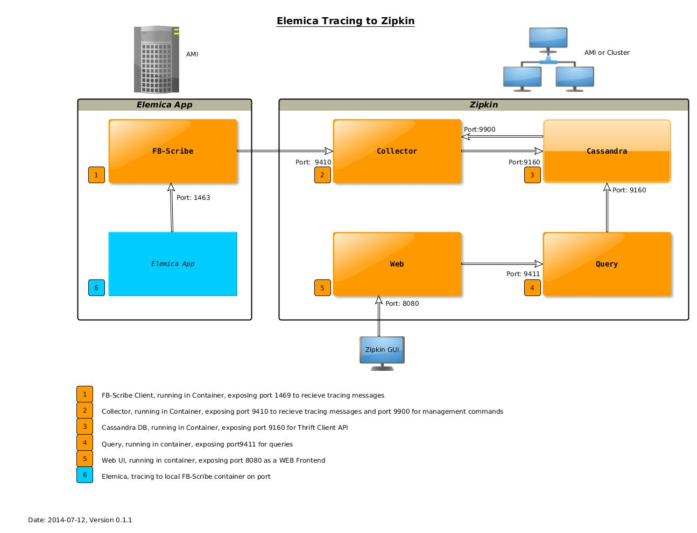

zipkin-infrastructure
=====================

All components needed to run Zipkin in Docker containers (Cassandra, Collector, Query, Web, and FB-Scribe)
We build a Zipkin base container installing scala and zipkin.
From this docker image, we derive the specific zipkin parts to combine a zipkin infrastructure.
Directorey fb-scribe will generate a facebook [scribe](https://github.com/facebookarchive/scribe) service 
ready to communicat with zipkin collector. The same functionallity can be obtained by using a [Scala Akka Tracing](https://github.com/levkhomich/akka-tracing) mechanism.

 

### Zipkin Port Structure
The ports and how to relate them is described in file [Ports.md](Ports.md).

#### AWS security group
As cassandra uses many ports a possible AWS security group is described by [DATASTAX](http://www.datastax.com/documentation/cassandra/2.0/cassandra/install/installAMISecurityGroup.html).

#### Building containers

Building the scribe container takes between 10 and 15 minutes on a 2GHz CPU depending on the memory available. 
The resulting image is about 800MB. We had to start an AMI of type `t2` to not run out of memory.
#### Usage
Two scripts build and deploy zipkin containers. To build them freshly just call [`./build.sh `](build.sh)` -f` and to pull them from registry call `./build.sh -r`.
To deploy and run zipkin container on one host call [`./deploy.sh`](deploy.sh)` -r` and to cleanup old containers call `./deploy.sh -c`.
######TODO 
 * Check for container link between web and query?
 * Configure linking between fb-scribe (or akka) and collector (`COLLECTOR_PORT`) running on different docker hosts.

#### Notes

Docker-Zipkin starts the services in their own container: zipkin-cassandra,
zipkin-collector, zipkin-query, zipkin-web and only link required dependencies
together.

The started Zipkin instance would be backed by a single node Cassandra. By
default, the collector port is not mapped to public. You will need to link
containers that you wish to trace with zipkin-collector or you may change the
respective line in deploy.sh to map the port.

All images with the exception of zipkin-cassandra are sharing a base image:
[base](https://github.com/elemica/zipkin-infrastructure/tree/master/base). zipkin-base and zipkin-cassandra are built on ubuntu:12.04.

Once the containers are running you can connect to the collector on
port 9410 via akka-tracing or other libraries that support Zipkin tracing. <https://github.com/levkhomich/akka-tracing>

#### Dockerfile
We try to place as many installation commands into Docker files, to ease the build process:
 * Each build step is frozen as an intermediate container
 * Errors during build don`t require rerunning it completely
 * Testing new install instructions start from a partly build process and thus run faster

#### Directory structure

 * [base](https://github.com/elemica/zipkin-infrastructure/tree/master/base) docker container with scala and zipkin installed
 * [cassandra](https://github.com/elemica/zipkin-infrastructure/tree/master/cassandra) docker container with cassandra installed
 * [collector](https://github.com/elemica/zipkin-infrastructure/tree/master/collector) docker container with zipkin collector installed
 * [query](https://github.com/elemica/zipkin-infrastructure/tree/master/query) docker container with zipkin query installed
 * [web](https://github.com/elemica/zipkin-infrastructure/tree/master/web) docker container with zipkin web
 * [script](https://github.com/elemica/zipkin-infrastructure/tree/master/script) contains utilites to manage (build, push, pull, start, deploy ) the zipkin container.

#### Source
This repo is cloned from [https://github.com/lispmeister/docker-zipkin.git](https://github.com/lispmeister/docker-zipkin.git) 
Zipkin base installation is describe in the [twitter zipkin repo](https://github.com/twitter/zipkin/blob/master/doc/install.md) and further configuration in detail in [Zipkin, from Twitter](http://twitter.github.io/zipkin/install.html).
#### Authors

Michael Klöckner <mkl@im7.de>

Markus Fix <lispmeister@gmail.com>

#### changelog 
* 2014-07-11 Added Zipkin documentation and port usage
* 2014-07-12 Added Port structure
* 2014-07-14 Minor docu changes
* 2014-07-15 Added script to build/deploy zipkin containers as a hole
* 2014-08-29 moved helper scripts into dir script/ and adopted config variables (logdir/dockerdir, ...)
